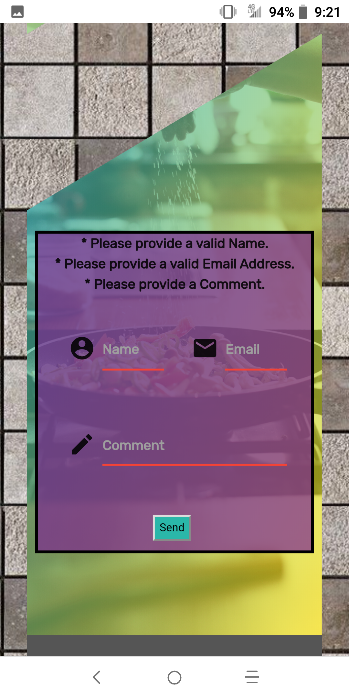

# [Empty Kitchen](https://decronin.github.io/project-one-ddb/)
#### By: [Dana Cronin](https://decronin.github.io/) & [David McCulloch](#)

### Concept:
On this Page or App one is able to Find Recipes relevant to Ingredients input (stackable based on contents of pantry), Search relevant videos and tutorials with popular chefs or categories and Easily Navigate through these options.

### Motivation:
We like food. 

Finding time to go to the grocery store can be difficult in a busy life and getting take-away over-frequently is neither cost-effective or healthy.

Sometimes there are plenty of things in the kitchen but one may have no clue how they go together or any inspiration for what they would like.

We want users to have that resource to explore or draw inspiration for their meal(s) without getting overwhelmed by the redundant, complicated or unreliable results they may find elsewhere after copious google-fu-fights.

### User Stories:
1) * As a user I should be able to find recipes with my designated ingredients.
2) * As a user I should be able to look at videos of chefs or tutorials.
3) * As a user I should be able to look through these results in a satisfying manner without the display being	 overwhelming to navigate.

### Current Display(s):

##### Phone:
(Alcatel 7)

##### Tablet:
(Coming Soon)

##### Desktop:

### Future Development:
* Favorites & Storage(s)
* Ingredients to Ignore
* Health Restrictions
* Account(s) Login / Personal Account(s)
  - Preferences
  - Inventory
  - Shopping List
* About Page / FAQs
* More Reliable API Key / Account Subscription
* Send Grid / Send Comments
* Recommendation Buttons
* Google Maps API
* Potential Store Extension(s)
  - Link or form to local Grocery Stores for pickup or delivery
* Evolve Theme over time
* Convert CSS with SASS
* More Compatible Responsiveness - Features
* ADs / Partnership(s)
* Spelling Checker on Input!
* Free version versus Subscription (E-Kitchen)
  - Kitchen Inventory 
  - Build Meal Plan(s)
  - Categories / Styles
  - Lunch / Snack / Breakfast / Dinner / Ect

### Resourses:
* HTML
* CSS
* JavaScript
* [jQuery](https://api.jquery.com/)
* [Materialize](https://materializecss.com/)
* [Glide.js](https://glidejs.com/)
* [Firebase](https://firebase.google.com/)
* [Youtube Data API](https://developers.google.com/youtube/v3)
* [Spoonacular API](https://spoonacular.com/)
* Images:
 * [Icon](https://www.pinclipart.com/pindetail/biRwJw_cook-freeze-cool-main-dishes-easy-fun-comfort/)
 * [Background Tile](https://www.pinterest.com/pin/571605377680749375/?autologin=true)
 * [Header](https://www.sciencenewsforstudents.org/article/studies-show-how-homes-can-pollute-indoor-air)
 * [Body](https://www.nbcnews.com/better/lifestyle/become-better-cook-avoiding-these-12-common-mistakes-ncna1064211)
